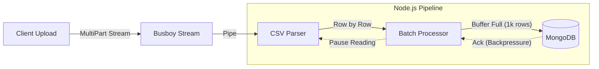

# Anti-OOM Processor


**[🇧🇷 Leia em Português](README_pt-br.md)**

High-performance CSV processing engine designed to handle multi-gigabyte files with a **constant low memory footprint**. Leveraging Node.js Streams and Backpressure, it prevents "Out-of-Memory" (OOM) crashes common in naive implementations.

---

## 💥 The Problem: "It works on my machine"

A common scenario in Node.js backends:
1.  Marketing uploads a `products.csv` file (500MB, 2 million rows).
2.  The server tries to read the entire file into RAM (`fs.readFile`).
3.  **Result:** `FATAL ERROR: Ineffective mark-compacts near heap limit Allocation failed - JavaScript heap out of memory`. The server crashes, restarting all active connections.

This project solves this by treating data as a **Flow**, not a Block.

---

## ✨ Demo


---

## 🌊 Architecture & Data Flow



### Key Technical Concepts:

1.  **Backpressure:** The system automatically pauses reading the file if the database writes become slow. The RAM usage never spikes because data "waits" on the disk/network, not in the heap.
2.  **Stream Pipeline:** Uses `stream.pipeline` to ensure proper cleanup and error handling. If the request is aborted, the file stream closes immediately.
3.  **Batch Processing:** Instead of inserting 1 row at a time (N+1 problem), we group rows into chunks of 1000 and perform `bulkWrite` operations, increasing Throughput by ~50x.

---

## 🛠 Tech Stack

-   **Runtime:** Node.js 20+ / TypeScript
-   **Framework:** Fastify (Low Overhead)
-   **Streaming Libs:**
    -   `@fastify/multipart` (Busboy wrapper)
    -   `csv-parse` (Streamable Parser)
-   **Database:** MongoDB + Mongoose (Bulk Operations)
-   **Observability:**
    -   Memory Usage Logging (Heartbeat)
    -   **Server-Sent Events (SSE)** for Real-Time Frontend Progress

---

## 🚀 Quick Start

### 1. Requirements
-   Node.js 18+
-   MongoDB (Local or Atlas)

### 2. Install Dependencies
```bash
npm install
```

### 3. Run Locally
```bash
# Start MongoDB (if using Docker)
docker-compose up -d 

# Start Application
npm run dev
```

### 4. Test with Large File
Instead of manually searching for a large CSV, use the included helper scripts to generate and upload a test file.

**A. Generate 100MB CSV**
```bash
npx ts-node scripts/generate-csv.ts
```
*Creates `large_file.csv` in the root (100MB).*

**B. Stream Upload to Server**
```bash
npx ts-node scripts/test-upload.ts
```
*This script streams the file preventing client-side OOM and logs the server response.*

**Observe the Logs:**
```text
[Progress] Processed: 10000 | Failed: 0 | Heap: 42MB
[Progress] Processed: 20000 | Failed: 0 | Heap: 43MB  <-- Stable Memory!
```

### 5. Real-Time Dashboard (SSE Demo)
To visualize the memory efficiency in real-time without external tools:

1.  Open the file `test-client.html` in your browser (drag and drop the file).
2.  Run the upload script in your terminal: `npm run upload`.
3.  Watch the dashboard update via **Server-Sent Events** while the RAM usage remains flat.

---

## ⚠️ Known Limitations

| Limitation | Solution in v2.0 |
| :--- | :--- |
| **Single Node** | Works on one server. For distributed processing, we would need to stream the file to Amazon S3 first and trigger an SQS Worker. |

---

## 👨‍💻 Author

**Gérson Resplandes**
Backend Engineer focused on Performance & Stream Architectures.

[]([https://www.linkedin.com/in/gerson-resplandes](https://www.linkedin.com/in/gerson-resplandes)/)
[](mailto:maiorgerson@gmail.com)
