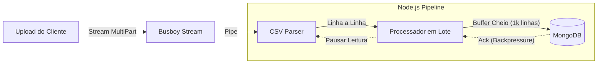

# Anti-OOM Processor


**[🇺🇸 Read in English](README.md)**

Engine de processamento de CSV de alta performance projetada para lidar com arquivos de múltiplos gigabytes com **consumo de memória baixo e constante**. Utilizando Node.js Streams e Backpressure, previne falhas de "Out-of-Memory" (OOM) comuns em implementações ingênuas.

---

## 💥 O Problema: "Funciona na minha máquina"

Um cenário comum em backends Node.js:
1.  O Marketing faz upload de um arquivo `produtos.csv` (500MB, 2 milhões de linhas).
2.  O servidor tenta ler o arquivo inteiro na memória RAM (`fs.readFile`).
3.  **Resultado:** `FATAL ERROR: Ineffective mark-compacts near heap limit Allocation failed - JavaScript heap out of memory`. O servidor trava e derruba todas as conexões ativas.

Este projeto resolve isso tratando os dados como um **Fluxo (Flow)**, e não como um Bloco.

---

## ✨ Demo


---

## 🌊 Arquitetura e Fluxo de Dados



### Conceitos Técnicos Chave:

1.  **Backpressure:** O sistema pausa automaticamente a leitura do arquivo se a escrita no banco de dados ficar lenta. O uso de RAM nunca dispara porque os dados "esperam" no disco/rede, não no heap.
2.  **Stream Pipeline:** Usa `stream.pipeline` para garantir limpeza correta e tratamento de erros. Se a requisição for abortada, a stream do arquivo fecha imediatamente.
3.  **Processamento em Lote (Batch):** Em vez de inserir 1 linha por vez (problema N+1), agrupamos linhas em chunks de 1000 e realizamos operações `bulkWrite`, aumentando o Throughput em ~50x.

---

## 🛠 Tech Stack

-   **Runtime:** Node.js 20+ / TypeScript
-   **Framework:** Fastify (Baixo Overhead)
-   **Libs de Streaming:**
    -   `@fastify/multipart` (Wrapper do Busboy)
    -   `csv-parse` (Parser compatível com Streams)
-   **Banco de Dados:** MongoDB + Mongoose (Bulk Operations)
-   **Observabilidade:**
    -   Log de Uso de Memória (Heartbeat)
    -   **Server-Sent Events (SSE)** para Progresso Visual em Tempo Real

---

## 🚀 Como Rodar (Quick Start)

### 1. Requisitos
-   Node.js 18+
-   MongoDB (Local ou Atlas)

### 2. Instalar Dependências
```bash
npm install
```

### 3. Executar Localmente
```bash
# Iniciar MongoDB (se usar Docker)
docker-compose up -d 

# Iniciar Aplicação
npm run dev
```

### 4. Testar com Arquivo Grande
Em vez de buscar manualmente um CSV gigante, utilize os scripts inclusos para gerar e enviar um arquivo de teste.

**A. Gerar CSV de 100MB**
```bash
npx ts-node scripts/generate-csv.ts
```
*Cria o arquivo `large_file.csv` na raiz do projeto (100MB).*

**B. Upload via Stream para o Servidor**
```bash
npx ts-node scripts/test-upload.ts
```
*Este script faz o streaming do arquivo (prevenindo OOM no cliente) e loga a resposta do servidor.*

**Observe os Logs:**
```text
[Progress] Processed: 10000 | Failed: 0 | Heap: 42MB
[Progress] Processed: 20000 | Failed: 0 | Heap: 43MB  <-- Memória Estável!
```

### 5. Dashboard em Tempo Real (Demo SSE)
Para visualizar a eficiência de memória em tempo real sem ferramentas externas:

1.  Abra o arquivo `test-client.html` no seu navegador (arraste e solte o arquivo).
2.  Rode o script de upload no seu terminal: `npm run upload`.
3.  Acompanhe a atualização do dashboard via **Server-Sent Events** enquanto o uso de RAM permanece estável.

---

## ⚠️ Limitações Conhecidas

| Limitação | Solução na v2.0 |
| :--- | :--- |
| **Single Node** | Funciona em um único servidor. Para processamento distribuído, precisaríamos enviar o arquivo para o Amazon S3 primeiro e acionar um Worker SQS. |

---

## 👨‍💻 Autor

**Gérson Resplandes**
Backend Engineer focado em Performance e Arquiteturas de Stream.

[](https://www.linkedin.com/in/gerson-resplandes-de-s%C3%A1-sousa-999bb33a3/)
[](mailto:maiorgerson@gmail.com)